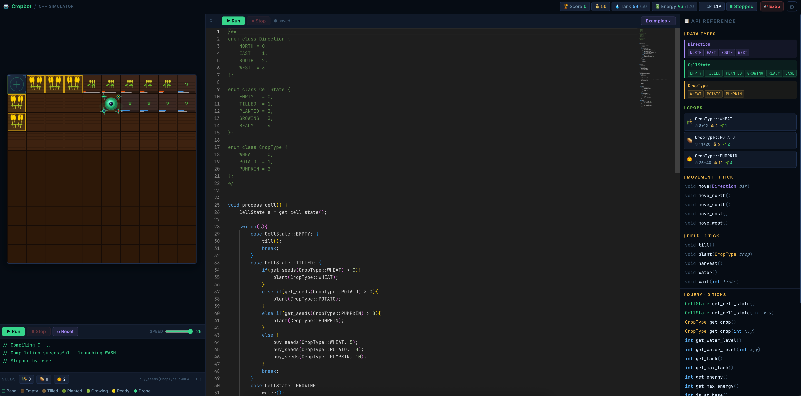

# Cropbot

> Program a farming drone in real C++. Watch it work.



A browser-based farming game where you write C++ code to automate a drone.
Your code is compiled to WebAssembly via Emscripten and runs live in the browser —
no plugins, no downloads, just a text editor and a field to farm.

---

## How it works

You write C++ in the browser. Click **Run**. The server compiles your code with `emcc`,
sends back a `.wasm` binary, and the drone starts executing your `main()` — tick by tick,
on a real grid, with real crops.

```cpp
int main() {
    while (true) {
        if (get_cell_state() == CellState::EMPTY)   till();
        if (get_cell_state() == CellState::TILLED)  plant(CropType::PUMPKIN);
        if (get_cell_state() == CellState::READY)   harvest();

        if (get_water_level() < 30 && get_tank() >= 15)
            water();

        move_east();
    }
}
```

---

## Quick start

```bash
npm install
node server.js
# open http://localhost:3000
```

**Requirements:** Node.js, [Emscripten](https://emscripten.org/docs/getting_started/downloads.html) (`emcc` in PATH)

---

## Drone API

All functions are available without any `#include`. The header is automatically
prepended to your code before compilation.

### Movement — 1 tick each

```cpp
void move(Direction dir);
void move_north();
void move_south();
void move_east();
void move_west();
```

### Farming — 1 tick each

```cpp
void till();                  // EMPTY → TILLED
void plant(CropType crop);    // TILLED → PLANTED
void harvest();               // READY  → EMPTY, earn gold
void water();                 // costs 15 tank units, gives cell +50 water
void wait(int ticks);
```

### State queries — 0 ticks

```cpp
CellState get_cell_state();
CellState get_cell_state(int x, int y);
CropType  get_crop();
CropType  get_crop(int x, int y);
int get_water_level();
int get_water_level(int x, int y);
int get_tank();
int get_max_tank();
int get_energy();
int get_max_energy();
int is_at_base();             // 1 if drone is at (0,0)
int get_x();
int get_y();
int get_ticks();
int get_score();
```

### Economy — 0 ticks

```cpp
int  get_gold();
int  get_seeds(CropType crop);
void buy_seeds(CropType crop, int count);
void buy_water(int packs);    // 50 tank units per pack, 10 gold each
void print(int val);
```

### Types

```cpp
enum class Direction  { NORTH, EAST, SOUTH, WEST };
enum class CellState  { EMPTY, TILLED, PLANTED, GROWING, READY, BASE };
enum class CropType   { WHEAT, POTATO, PUMPKIN, CORN, MUSHROOM, COFFEE };
```

---

## Crops

| Crop     | Growth      | Sell  | Seed  | Profit | Gold/tick | Unlock  |
|----------|-------------|-------|-------|--------|-----------|---------|
| Wheat    | 8+12 ticks  | 2 🪙  | 1 🪙  | 1      | 0.050     | free    |
| Potato   | 14+20 ticks | 6 🪙  | 2 🪙  | 4      | 0.118     | free    |
| Pumpkin  | 25+40 ticks | 10 🪙 | 5 🪙  | 5      | 0.077     | 80 🪙   |
| Corn     | 18+27 ticks | 9 🪙  | 3 🪙  | 6      | 0.133     | 280 🪙  |
| Mushroom | 15+25 ticks | 10 🪙 | 4 🪙  | 6      | 0.150     | 650 🪙  |
| Coffee   | 40+80 ticks | 35 🪙 | 20 🪙 | 15     | 0.125     | 1500 🪙 |

**Mushroom:** grows only if `water_level > 40` — requires preventive watering strategy.
**Water:** every planted/growing cell loses 2 water/tick. Growth pauses at 0.
**Tank:** holds water for `water()` calls. Refills at base (+8/tick).
**Battery:** every action costs 1 energy. Recharges at base (+10/tick).

---

## Base (0, 0)

- Farming actions (`till`, `plant`, `water`, `harvest`) are no-ops at base
- Auto-refills tank and battery each tick while the drone is here
- `is_at_base()` returns `1` when drone is at (0, 0)

---

## Upgrades

Purchased from the **Extra** panel in-game. Permanent until reset.

| Upgrade          | Per level | Max level | Max value | Start cost |
|------------------|-----------|-----------|-----------|------------|
| Tank Capacity    | +10       | 10        | 150       | 60 🪙      |
| Battery Capacity | +24       | 10        | 360       | 100 🪙     |

Cost multiplier: ×1.65 per level.

---

## Architecture

```
Browser
├── index.html          UI, styles, API reference panel
├── game.js             Game engine, renderer, WASM orchestration
│   ├── growTick()      Crop growth + water drain per tick
│   ├── droneActions{}  Bridge between WASM calls and game state
│   ├── execWasmAction()Dispatches action codes from Worker
│   └── wasmActionLoop()Listens to SharedArrayBuffer via Atomics.waitAsync
└── wasm-worker.js      Web Worker — runs compiled WASM
    └── callMain()      Blocks Worker via Atomics.wait, wakes main thread

Server (Node.js)
├── POST /compile       Runs emcc, returns .wasm bytes
└── COOP/COEP headers   Required for SharedArrayBuffer to work
```

### WASM ↔ Main thread communication

The Worker runs `main()` which blocks on `Atomics.wait()` for every drone API call.
The main thread uses `Atomics.waitAsync()` to react, executes the action, writes the
result into a `SharedArrayBuffer`, then wakes the Worker with `Atomics.notify()`.

```
Worker              SharedArrayBuffer           Main thread
  │                 [ACTION][ARG0][ARG1]           │
  │── write action ──────────────────────────────> │
  │── Atomics.wait(RESPONSE) ─────────────────>    │
  │                                   execWasmAction()
  │                 [RESULT][RESPONSE=1]            │
  │<─────────────────────────────── Atomics.notify ─│
  │── read result ──────────────────────────────    │
```

---

## File structure

```
farm.cpp/
├── index.html        Markup, styles, in-game API panel
├── game.js           All game logic (~1700 lines)
├── wasm-worker.js    Web Worker for WASM execution
├── drone_api.h       Drone API header (auto-prepended on compile)
├── server.js         Express server: /compile endpoint + static files
├── package.json      Dependencies (express)
├── ideas/            Design notes and feature ideas
│   ├── crops.md
│   └── field_expansion.md
└── README.md
```

---

## Adding a new drone function

Three files must be updated in sync:

**1. `drone_api.h`**
```cpp
extern "C" { int get_something(); }
```

**2. `game.js`**
```js
// in const ACT:
GET_SOMETHING: 31,

// in QUERY_ACTIONS set (if it costs 0 ticks):
ACT.GET_SOMETHING,

// in execWasmAction() switch:
case ACT.GET_SOMETHING: result = droneActions.get_something(); break;

// in droneActions{}:
get_something() { return /* value */; },
```

**3. `wasm-worker.js`**
```js
// in const ACT:
GET_SOMETHING: 31,

// in makeDroneEnv():
get_something: () => callMain(ACT.GET_SOMETHING),
```

---

## Why the server is required

`SharedArrayBuffer` is blocked by browsers unless the page is served with:

```
Cross-Origin-Opener-Policy: same-origin
Cross-Origin-Embedder-Policy: require-corp
```

Opening `index.html` directly via `file://` will not work.
Any static file server that can set these headers works — the Node.js server is
just the simplest setup that also handles compilation.
